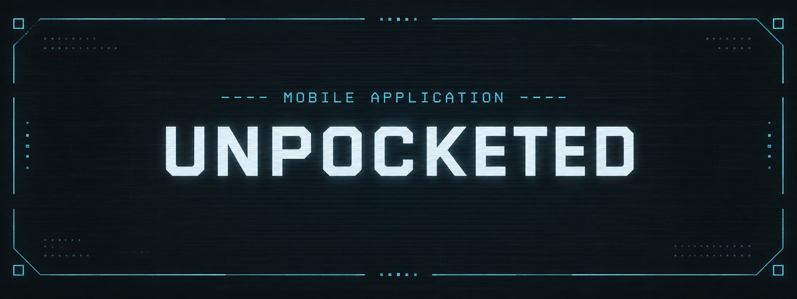

<div align="center">
  <!-- cover logo -->
  <p align='center'>
    
  </p>
  <!-- sub headline -->
  <h2>
     Local-First Audio Recording &amp; Transcription
  </h2>
  <!-- tech used in this project -->
  <p>
    <a href="https://skillicons.dev">
      <br>
    </a>
  </p>
  <!-- spec link -->
  <h5>
      <a href='docs/spec.md'>
          read the specification ↗
      </a>
  </h5>
</div>

<br>
<!-- -------------------------------------------------------------------------- -->

### Brief Introduction
----
Unpocketed is an open-source Android application for recording, importing, transcribing and exporting spoken audio. <br/>
It runs entirely on your device. There is no account, no subscription, and no Unpocketed server — recordings, transcripts and settings stay in local storage, and your API keys stay in the platform keystore. When you want a recording transcribed, you choose the provider and the model, supply your own credentials, and your phone talks to that service directly. The original audio is never destructively modified, so any transcript can be thrown away and regenerated with a better model later.

> **Status: planning.** There is no application code in this repository yet — it currently holds the specification and the decision map that precede v0.1.

<br/>
<br/>


### Application Flow
---

Unpocketed has two ways in — record on the device, or import audio captured elsewhere — and both produce the same kind of Recording. From there, transcription is an explicit, user-triggered step that leaves the device only when asked.

```text
┌──────────────────────┐                  ┌──────────────────────┐
│   Record on device   │                  │    Import a file     │
│  mic · background    │                  │  M4A · MP3 · WAV     │
└──────────┬───────────┘                  └──────────┬───────────┘
           │                                         │
           └───────────────┐         ┌───────────────┘
                           ▼         ▼
                    ┌──────────────────────┐
                    │  Expo / React Native │
                    │      Unpocketed      │
                    └──────────┬───────────┘
                               │
                 ┌─────────────┴─────────────┐
                 ▼                           ▼
      ┌──────────────────────┐    ┌──────────────────────┐
      │  On-device storage   │    │ Your transcription   │
      │ files · SQLite · keys│    │ provider · your key  │
      └──────────────────────┘    └──────────────────────┘
             always                    only when you ask
```

There is deliberately no `phone → Unpocketed API → provider` hop. That keeps this project out of the path of your recordings, your credentials, your billing and your transcripts.

<br/>
<br/>
<!-- -------------------------------------------------------------------------- -->

### Four Promises
----
v0.1 is finished when these four can be made confidently — and not before.

| | |
|---|---|
| **Record well** | Good-quality recordings from hardware you already own, benchmarked against your phone's stock recorder. |
| **Keep the original** | Transcription never rewrites the source audio. A transcript can be regenerated; a lost recording cannot. |
| **Transcribe however you want** | Transcription sits behind a provider adapter — Groq, OpenAI, Deepgram, a self-hosted endpoint, or something that doesn't exist yet. |
| **Get your data back out** | Audio, TXT, Markdown and JSON export. No account, no paywall, no proprietary conversion step. |

<br/>
<br/>
<!-- -------------------------------------------------------------------------- -->

### Why This Exists
----
A growing category of AI recording products pairs dedicated hardware with a proprietary transcription service. That bundle tends to arrive with constraints that have nothing to do with recording audio: you use the manufacturer's transcription model, better models stay out of reach, useful features sit behind a subscription, and your recordings accumulate inside someone else's ecosystem.

Meanwhile the phone already in your pocket has a capable microphone, ample storage and a connection — and speech-to-text models have become largely interchangeable commodities.

So the useful product isn't the hardware or the model. It's the thin, honest layer between them, one that doesn't insist on owning the relationship.

A recording is a file. A transcript is text. A model turns one into the other. You own all three decisions: **what to record, where to keep it, and which model gets to listen.**

<br/>
<br/>
<!-- -------------------------------------------------------------------------- -->

### Roadmap
----
v0.1 ships as ten sequential pieces of work. Full detail is in [§38 of the specification](docs/spec.md).

<details>
<summary>Click here to expand</summary>

<br/>

| | Milestone | Done when | Status |
|---|---|---|---|
| **1** | Foundation and static interface | The app runs locally and looks like the product, on mock data | Shipped |
| **2** | Android development environment | A development build is installed and debugged on a physical device | Shipped |
| **3** | Audio recording | A real recording can be created and replayed after the session ends | Shipped |
| **4** | Persistent library and playback | Recordings survive an app restart and remain playable | In progress |
| **5** | Background recording and resilience | An hour-long real-world recording can be trusted | Not started |
| **6** | External audio import | An externally exported recording imports and plays | Not started |
| **7** | Initial transcription | A recording produces and displays a real transcript | Not started |
| **8** | Bring-your-own provider | The same recording transcribes under two different models | Not started |
| **9** | Transcript ownership | Import, transcribe, compare, edit and export without lock-in | Not started |
| **10** | Polish and Android release | A stranger can install the APK and do all of the above unaided | Not started |

**Explicitly out of scope for v0.1:** accounts, cloud storage, sync, subscriptions, summaries, mind maps, chat-with-your-recordings, semantic search, speaker profiles, iOS, and on-device Whisper. Some may come later; none is needed to prove the core product.

</details>

<br/>
<br/>
<!-- -------------------------------------------------------------------------- -->

### Running Locally
----

Unpocketed can be run in two ways during development:

- **On your computer**
  - **Browser** — quickest for UI and layout work
  - **Android Emulator** — runs the full Android app locally
  - See [**Emulator Setup**](docs/emulator-setup.md)

- **On a physical Android device**
  - **Development build** — runs against the local Expo development server
  - **Standalone APK** — runs without the development server *(coming later)*
  - See [**Device Setup**](docs/device-setup.md)

Both start from the same one-time toolchain install — JDK, Android SDK and environment variables: [**Android development setup**](docs/android-setup.md). A development build is required rather than Expo Go, because Unpocketed needs native modules for audio recording, secure storage and foreground services; the browser renders the interface but implements none of them.

Then **configure transcription**: open **Settings** in the app and add your own provider API key. Keys are held in the device keystore, never in the database or a config file, and never leave the device except as an authorisation header to the provider you chose.

#### Notes

- Transcription is the only feature that requires a network connection. Recording, playback, import, rename, delete, export and reading existing transcripts all work offline.
- Cloud transcription sends that recording to the external provider you selected, under their pricing and privacy terms.
- If you hit a problem, check the [Issues](https://github.com/DevonGifford/UnPocketed/issues) page for an existing report, or open a new one.

<br/>
<br/>
<!-- -------------------------------------------------------------------------- -->

### Privacy & Responsible Recording

Recordings and transcripts stay on your device unless you explicitly send them to a transcription or AI provider you choose. Unpocketed has no accounts, no cloud storage, and no analytics. Android device backup is left enabled, so recordings may also be included in your own Google Drive backup. See [**PRIVACY.md**](PRIVACY.md) for provider-specific details.

Recording laws vary by location and situation, and Unpocketed does not decide whether a recording is lawful. **You are responsible for making sure you have permission, or another lawful basis, before recording a conversation.**

Unpocketed will not include features designed to hide that recording is taking place, and Android's microphone indicator remains visible while recording.

<br/>
<br/>
<!-- -------------------------------------------------------------------------- -->

### Documentation
----

| Document | What it covers |
|---|---|
| [Specification](docs/spec.md) | Product and technical spec for v0.1 |
| [Privacy](PRIVACY.md) | What stays on the device, what leaves it, and when |
| [Domain glossary](CONTEXT.md) | The project's vocabulary, and the words to avoid |
| [Android setup](docs/android-setup.md) | Getting a local build toolchain working |
| [Emulator setup](docs/emulator-setup.md) | Running the app in a browser or on an Android emulator |
| [Device setup](docs/device-setup.md) | Running the app on a physical handset, tethered or not |
| [Releasing](docs/releasing.md) | Producing a signed APK or AAB, and what Play asks for |
| [Artwork](docs/artwork.md) | The icon and splash files still outstanding, and their sizes |
| [AGENTS.md](AGENTS.md) | Orientation for coding agents working in this repo |
| [Decision map](.scratch/v0-1-derisk/map.md) | What is settled, what is still open |

<br/>
<br/>
<!-- -------------------------------------------------------------------------- -->

### Licence
----
[MIT](LICENSE) © 2026 Devon Gifford
